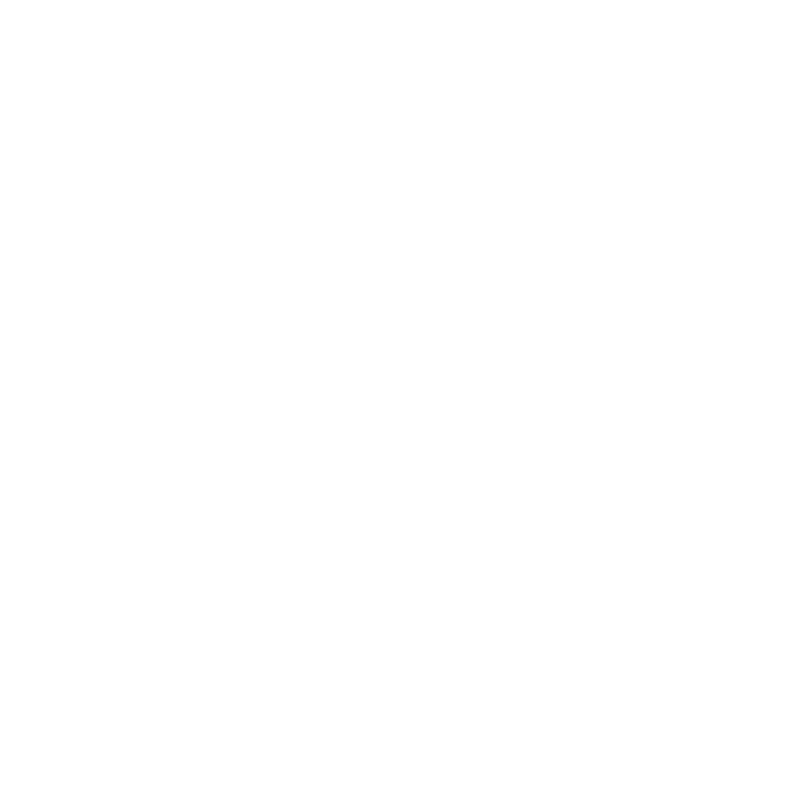

# Obscura Academy
**An interactive platform for learning cryptography, steganography, and coding through hands-on challenges.**



## About the Project
Obscura Academy is an interactive **learning platform** designed for **beginners interested in cryptography, steganography, and coding**. Inspired by **ARGs (Alternate Reality Games)** and **internet mysteries**, this academy provides an engaging way to explore encryption, hidden messages, and digital forensics.

- **Learn fundamental cryptographic techniques** like the **Caesar cipher, Vigenère cipher, and substitution ciphers**.  
- **Explore steganography**, including **hiding text in images and SSTV encoding**.  
- **Develop basic coding skills** with **Python and HTML analysis**.  
- **Solve interactive challenges** where users must **decrypt messages, analyze files, and uncover hidden clues**.


## Features
- **Cryptography Lessons** → Interactive explanations of classic ciphers.  
- **Steganography Exploration** → Techniques for hiding and extracting messages from images and audio.  
- **File Analysis** → Extract metadata, inspect hex data, and analyze file structures.  
- **Coding Basics** → Learn Python, HTML, and useful developer tools.  
- **Interactive Challenges** → Hands-on exercises to test and apply what you've learned.  
- **Built-in AI Assistant (The Oracle)** → Ask cryptography-related questions and receive interactive challenges.  


## Built With
- **Python** → Core logic for cryptographic functions and challenges.
- **Streamlit** → Interactive web-based interface.
- **pystegano** → Used for hiding and extracting messages in images.
- **pysstv** → SSTV image-to-audio encoding.
- **exifread & mutagen** → Extract metadata from images, audio, and PDFs.
- **PyPDF2** → Analyze and extract metadata from PDF files.
- **OpenAI GPT-4o-mini** → AI-powered cryptography assistant.


## Installation & Setup
To run **Obscura Academy** on your local machine:

### 1. Clone the Repository
```bash
git clone https://github.com/yourusername/obscura-academy.git
cd obscura-academy
```

### 2. Install Required Dependencies
```bash
pip install -r requirements.txt
```

### 3. Run the application
```bash
streamlit run main.py
```

## Contributors
This project was created during the **Kent Hack Enough 2025 Hackathon**.

**Developed by:** Lucas Arantes 

🔗 **GitHub Repository:** [Obscura Academy](https://github.com/LMArantes/obscura-academy)

If you’d like to contribute, feel free to **fork the project** and submit **pull requests**! 


## Get Started
**Run the app or check out the live version here:**  

**[Obscura Academy (Streamlit)](https://obscura-academy.streamlit.app/)**


[](https://lmarantes.github.io/Modified-Attribution-License/)
